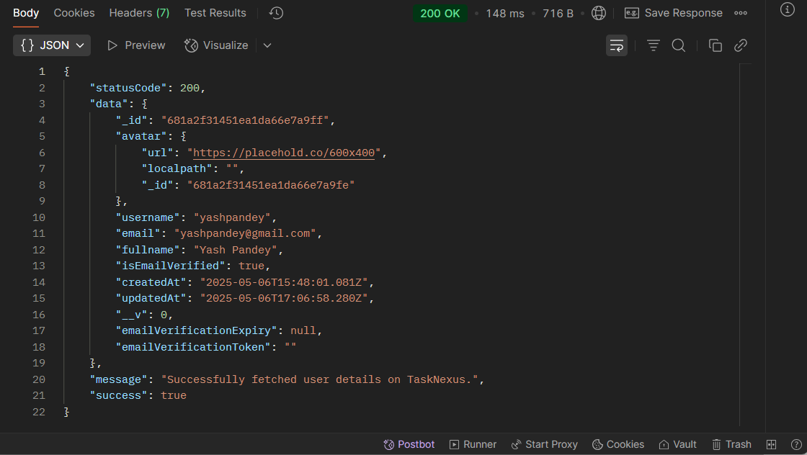

## 📝 Get User - Authorization Route `(TaskNexus Project)`

This route allows users to getUser Details Based On UserID on the TaskNexus platform by providing the required credentials.

---

### 📍 Endpoint `getUser`

- **Method:** `GET`
- **Endpoint:** `http://localhost:8080/api/v1/auth/get-user/:userID`
- **Example:** `http://localhost:8080/api/v1/auth/get-user/681a2f31451ea1da66e7a9da`
- **Description:** Returns the User Object Based On userID.

---

### ✅ Successful Response

On successful request, the server responds with a Success JSON object:

```json
{
  "statusCode": 200,
  "data": {
    "_id": "681a2f31451ea1da66e7a9ff",
    "avatar": {
      "url": "https://placehold.co/600x400",
      "localpath": "",
      "_id": "681a2f31451ea1da66e7a9fe"
    },
    "username": "yashpandey",
    "email": "yashpandey@gmail.com",
    "fullname": "Yash Pandey",
    "isEmailVerified": true,
    "createdAt": "2025-05-06T15:48:01.081Z",
    "updatedAt": "2025-05-06T17:06:58.280Z",
    "__v": 0,
    "emailVerificationExpiry": null,
    "emailVerificationToken": ""
  },
  "message": "Successfully fetched user details on TaskNexus.",
  "success": true
}
```

---

### 📸 Screenshot of Response on Postman

---

#### ✅ Successful getUser Response



---

### 📌 Purpose

The `getUser` route handles user Object Return setup, ensuring secure onboarding for users on the TaskNexus platform.
