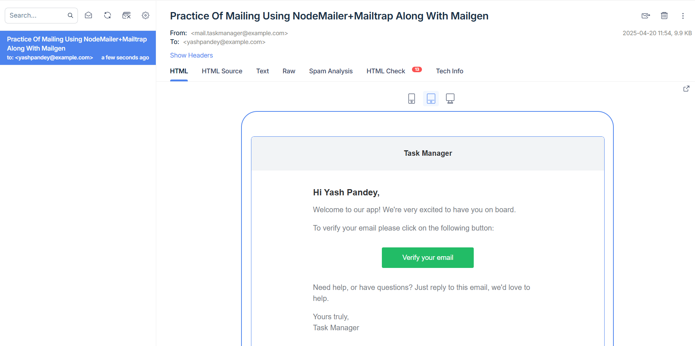

# ✉️ Email Service using Mailgen, Nodemailer & Mailtrap

This project demonstrates how to craft professional and responsive emails using **Mailgen**, send them through **Nodemailer**, and test delivery via **Mailtrap's SMTP server**. It's perfect for use cases like email verification, password reset flows, and onboarding emails.

---

## 🚀 Tech Stack

- **Mailgen** – To generate beautiful, responsive HTML emails easily
- **Nodemailer** – To send emails via SMTP
- **Mailtrap** – To capture/test emails in a safe development environment
- **Node.js** – Backend platform for implementation

---

## 🛠️ Installation & Setup

1. **Clone the Repository**

   ```bash
   git clone https://github.com/your-username/email-service.git
   cd email-service
   ```

2. **Install Dependencies**

   ```bash
   npm install
   ```

3. **Configure Environment Variables**

   Create a `.env` file in the root of your project and add your Mailtrap credentials:

   ```env
   MAILTRAP_SMTP_HOST=smtp.mailtrap.io
   MAILTRAP_SMTP_PORT=587
   MAILTRAP_SMTP_USER=your_mailtrap_username
   MAILTRAP_SMTP_PASS=your_mailtrap_password
   ```

4. **Run the App**
   You can import the `sendEmail` utility and use it in your backend logic to send emails.

---

## 🧩 Usage Demo

### 1. Initialize mailgen instance with default theme and brand configuration

```js
const mailGenerator = new Mailgen({
  theme: "default",
  product: {
    name: "Task Manager",
    link: "https://taskmanager.app",
  },
});
// Generate the plaintext & HTML version of the e-mail
const emailTextual = mailGenerator.generatePlaintext(options.mailgenContent);
const emailHtml = mailGenerator.generate(options.mailgenContent);
```

### 2. Create a nodemailer transporter instance which is responsible to send a mail

```js
const transporter = nodemailer.createTransport({
  host: process.env.MAILTRAP_SMTP_HOST, // MailTrap-SMTP host
  port: process.env.MAILTRAP_SMTP_PORT, // SMTP port
  auth: {
    user: process.env.MAILTRAP_SMTP_USER, // SMTP username
    pass: process.env.MAILTRAP_SMTP_PASS, // SMTP password
  },
});
```

### 3. The Actual mail object that will be sent to the user....

```js
const mail = {
  from: "mail.taskmanager@example.com", // We can name this anything. The mail will go to your Mailtrap inbox
  to: options.email, // receiver's mail
  subject: options.subject, // mail subject
  text: emailTextual, // mailgen content textual variant --> for clients that do not support HTML....
  html: emailHtml, // mailgen content html variant --> for clients that support HTML....
};
```

### 4. Fire The Email....

```js

```

// Send the mail using the transporter instance.....
await transporter.sendMail(mail);

---

## 🧠 Best Practices

- Keep email sending logic decoupled from your core business logic.
- Always send both HTML and plaintext versions for email client compatibility.
- Avoid crashing your app due to email delivery failures—fail silently and log for review.
- Use environment variables to keep credentials secure.

---

## 📸 Screenshot


