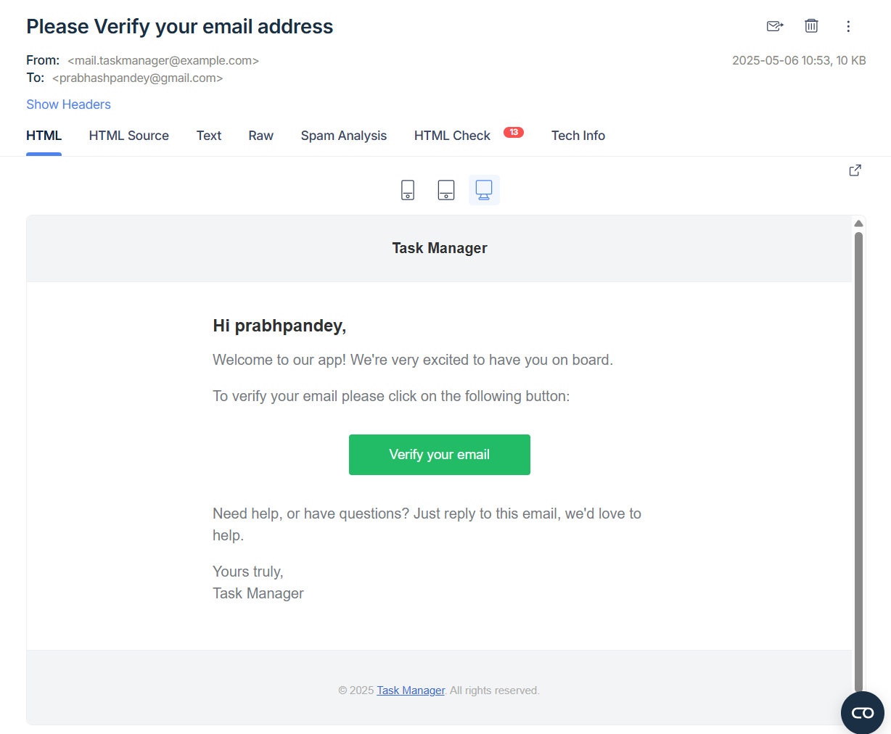
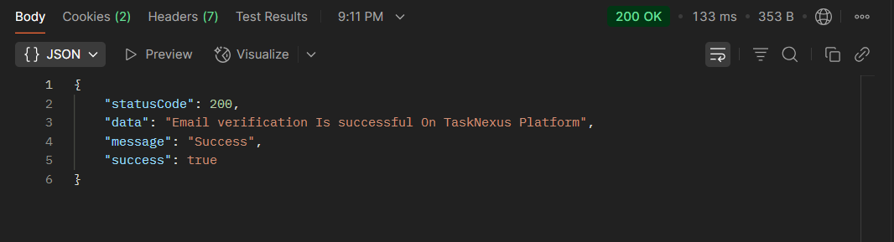

## 📝 Forgot-Password - Authorization Route `(TaskNexus Project)`

This route allows users to change Theie Forgotted Password on the TaskNexus platform by providing the required credentials.

---

### 🔐 **User Authentication Endpoints**

1. **Register (Signup/Login)**

   - **Method:** `POST`
   - **Endpoint:** `http://localhost:8080/api/v1/auth/register`
   - **Description:** Register a new user or initiate login if already registered.

2. **Email Verification**

   - **Method:** `GET`
   - **Endpoint:** `http://localhost:8080/api/v1/auth/verify-email/:token`
   - **Example:** `http://localhost:8080/api/v1/auth/verify-email/dbb8091f07f02026dc88cb25654de2f01d69c653`
   - **Description:** Verifies the user's email using the token sent via email.

---

### ✅ Successful Response

On successful Email Verification, the server responds with a JSON object:

```json
{
  "statusCode": 200,
  "data": "Email verification Is successful On TaskNexus Platform",
  "message": "Success",
  "success": true
}
```

---

### 📸 Screenshot of Response on Postman

---

#### ✅ Successful Registration Response


#### 🍪 Cookies in Postman


#### 📸 verification Mail Via Nodemailer + mailTrap



#### 📸 Successful Email verification



---

### 📌 Purpose

The `verifyEmail` route handles User Email verification setup, ensuring secure onboarding for users on the TaskNexus platform.
