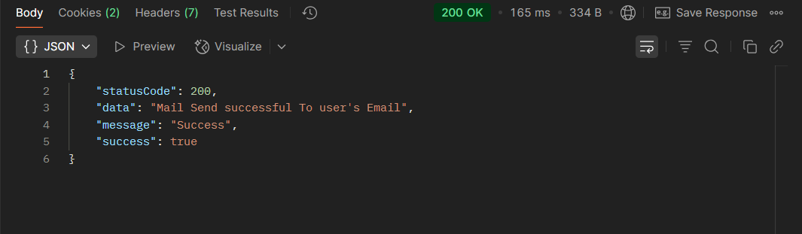
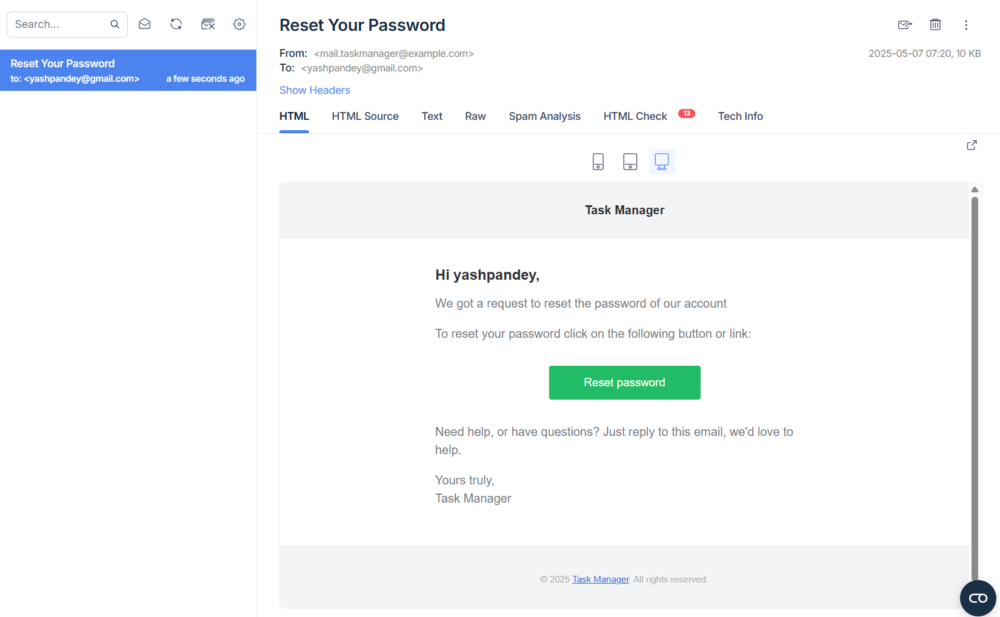

## 📝 Forgot-Password - Authorization Route `(TaskNexus Project)`

This route allows users to change Theie Forgotted Password on the TaskNexus platform by providing the required credentials.

---

### 🔐 **User Authentication Endpoints**

#### 1. **Forgot Password Request**

- **Method:** `POST`
- **Endpoint:** `http://localhost:8080/api/v1/auth/forgot-password-request`
- **Description:** Initiates a password reset process by sending a reset link to the user's registered email.
- **Request Body:**

```json
{
  "email": "pandeyyash041@gmail.com"
}
```

> 🔹 **Note:** The email must be registered in the system.

---

#### 2. **Frontend - Forgot Password Flow**

- **Route Triggered:** `GET /forgot-password-change/:token`
- **Description:**
  The frontend captures the token from the URL and renders a **Change Password** form with the following fields:

  - `password`
  - `confirmPassword`

On submission, the form sends a `POST` request to the same endpoint with the token and new password values.

---

#### 3. **Reset Forgotten Password**

- **Method:** `POST`
- **Endpoint:** `http://localhost:8080/api/v1/auth/forgot-password-change/:token`
- **Example:**
  `http://localhost:8080/api/v1/auth/forgot-password-change/dbb8091f07f02026dc88cb25654de2f01d69c653`
- **Description:** Verifies the token and updates the user's password.
- **Request Body:**

```json
{
  "password": "abcd",
  "confirmPassword": "abcd"
}
```

> 🔐 **Note:** Password and confirmPassword must match and meet security criteria (if enforced).

---

### ✅ Successful Response

On successful Forgotted-Password Change, the server responds with a JSON object:

```json
{
  "statusCode": 200,
  "data": {
    "_id": "681a2f31451ea1da66e7a9ff",
    "avatar": {
      "url": "https://placehold.co/600x400",
      "localpath": "",
      "_id": "681a2f31451ea1da66e7a9fe"
    },
    "username": "yashpandey",
    "email": "yashpandey@gmail.com",
    "fullname": "Yash Pandey",
    "isEmailVerified": true,
    "createdAt": "2025-05-06T15:48:01.081Z",
    "updatedAt": "2025-05-07T07:58:43.558Z",
    "__v": 0,
    "emailVerificationExpiry": null,
    "emailVerificationToken": "",
    "forgotPasswordExpiry": null,
    "forgotPasswordToken": ""
  },
  "message": "Successfully Changes user's Password on TaskNexus.",
  "success": true
}
```

---

### 📸 Screenshot of Response on Postman

---

#### ✅ Successful Forgot-Password Email



#### 📸 verification Mail Via Nodemailer + mailTrap



#### ✅ Successful Password Change verification


---

### 📌 Purpose

The `/forgot-password-request` & `/forgot-password-change/:token` route handles User Password Change setup When User Forgot It's Password, ensuring secure onboarding for users on the TaskNexus platform.
