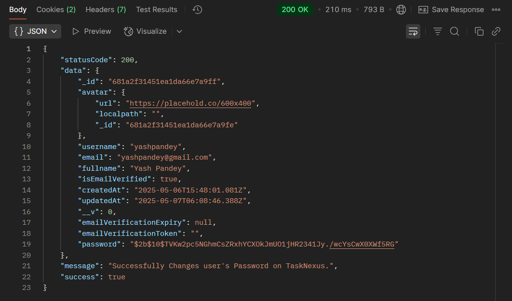

## 📝 change Password - Authorization Route `(TaskNexus Project)`

This route allows users to change User's Password on the TaskNexus platform by providing the User Is Logged In On The Platform.

---

### 🔐 **User Authentication Endpoints**

1. **Register (Signup/Login)**

   - **Method:** `POST`
   - **Endpoint:** `http://localhost:8080/api/v1/auth/register`
   - **Description:** Register a new user or initiate login if already registered.

2. **Change Password**

   - **Method:** `GET`
   - **Endpoint:** `http://localhost:8080/api/v1/auth/change-password`
   - **Description:** Changes the user's password using the Access Token send via req.cookies.

---

### ✅ Successful Response

On successful Password Change, the server responds with a JSON object:

```json
{
  "statusCode": 200,
  "data": {
    "_id": "681a2f31451ea1da66e7a9ff",
    "avatar": {
      "url": "https://placehold.co/600x400",
      "localpath": "",
      "_id": "681a2f31451ea1da66e7a9fe"
    },
    "username": "yashpandey",
    "email": "yashpandey@gmail.com",
    "fullname": "Yash Pandey",
    "isEmailVerified": true,
    "createdAt": "2025-05-06T15:48:01.081Z",
    "updatedAt": "2025-05-07T06:08:46.388Z",
    "__v": 0,
    "emailVerificationExpiry": null,
    "emailVerificationToken": ""
  },
  "message": "Successfully Changes user's Password on TaskNexus.",
  "success": true
}
```

---

### 📸 Screenshot of Response on Postman

---

#### ✅ Successful Registration Response


#### 🍪 Cookies in Postman


#### ✅ Successful Password Change



---

### 📌 Purpose

The `changePassword` route handles User's Change Password setup, ensuring secure onboarding for users on the TaskNexus platform.
