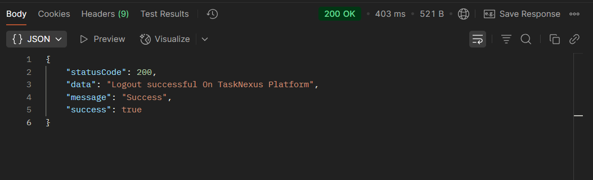

## 📝 Logout User - Authorization Route `(TaskNexus Project)`

This route allows users to Logout User From the TaskNexus platform .

---

### 🔐 **User Authentication Endpoints**

1. **Register (Signup/Login)**

   - **Method:** `POST`
   - **Endpoint:** `http://localhost:8080/api/v1/auth/register`
   - **Description:** Register a new user or initiate login if already registered.

2. **Logout User**

   - **Method:** `GET`
   - **Endpoint:** `http://localhost:8080/api/v1/auth/logout`
   - **Description:** Logout the user using the token sent via cookies.

---

### ✅ Successful Response

On successful Logout , the server responds with a JSON object:

```json
{
  "statusCode": 200,
  "data": "Logout successful On TaskNexus Platform",
  "message": "Success",
  "success": true
}
```

---

### 📸 Screenshot of Response on Postman

---

#### ✅ Successful Registration Response


#### 🍪 Cookies in Postman


#### ✅ Successful User Logout



---

### 📌 Purpose

The `logoutUser` route handles User Logout setup, ensuring secure onboarding for users on the TaskNexus platform.
