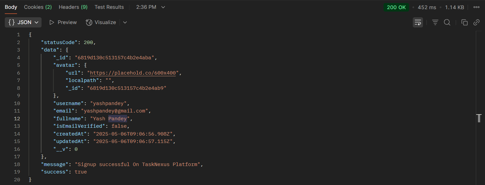
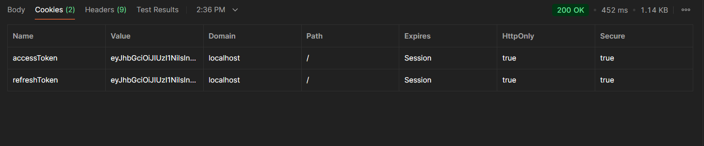
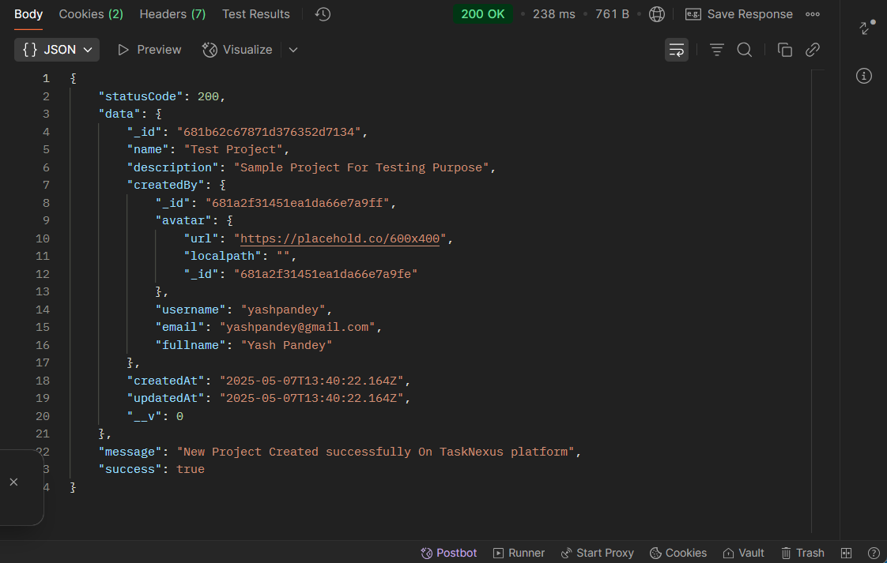

## 📝 Create Project - Project Route `(TaskNexus Project)`

This route allows users to Create Project on the TaskNexus platform.

---

### 🔐 1. User Authentication Required

Ensure the user is **logged in** before attempting to create a project.

**Endpoint:**
`POST http://localhost:8080/api/v1/auth/login`

---

### 🚀 2. Create a New Project

After successful login, send a POST request to the following endpoint with the required JSON body.

**Endpoint:**
`POST http://localhost:8080/api/v1/project/create`

**Request Body (raw JSON):**

```json
{
  "name": "Test Project",
  "description": "Sample project for testing purposes"
}
```

---

### 📥 Request Body (JSON)

The following fields are required:

```json
{
  "name": "Test Project",
  "description": "Sample project for testing purposes"
}
```

---

### ✅ Successful Response

On successful login, the server responds with a JSON object and sets **two HTTP-only cookies**:

```json
{
  "statusCode": 200,
  "data": {
    "_id": "681b62c67871d376352d7134",
    "name": "Test Project",
    "description": "Sample Project For Testing Purpose",
    "createdBy": {
      "_id": "681a2f31451ea1da66e7a9ff",
      "avatar": {
        "url": "https://placehold.co/600x400",
        "localpath": "",
        "_id": "681a2f31451ea1da66e7a9fe"
      },
      "username": "yashpandey",
      "email": "yashpandey@gmail.com",
      "fullname": "Yash Pandey"
    },
    "createdAt": "2025-05-07T13:40:22.164Z",
    "updatedAt": "2025-05-07T13:40:22.164Z",
    "__v": 0
  },
  "message": "New Project Created successfully On TaskNexus platform",
  "success": true
}
```

---

### 📸 Screenshot of Response on Postman

---

#### ✅ Successful Login Response



#### 🍪 Cookies in Postman



#### ✅ Sucsessful Project Creation



---

### 📌 Purpose

The `create` route handles Project Creation setup on the TaskNexus platform.
