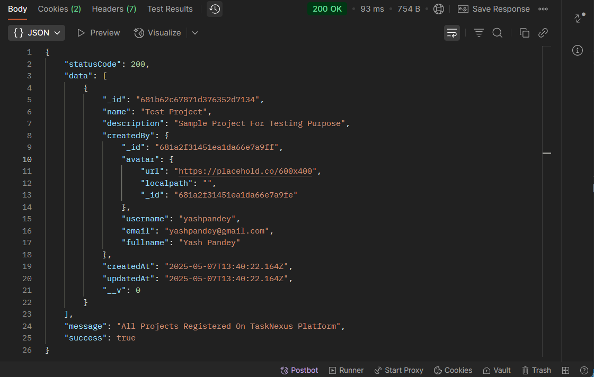
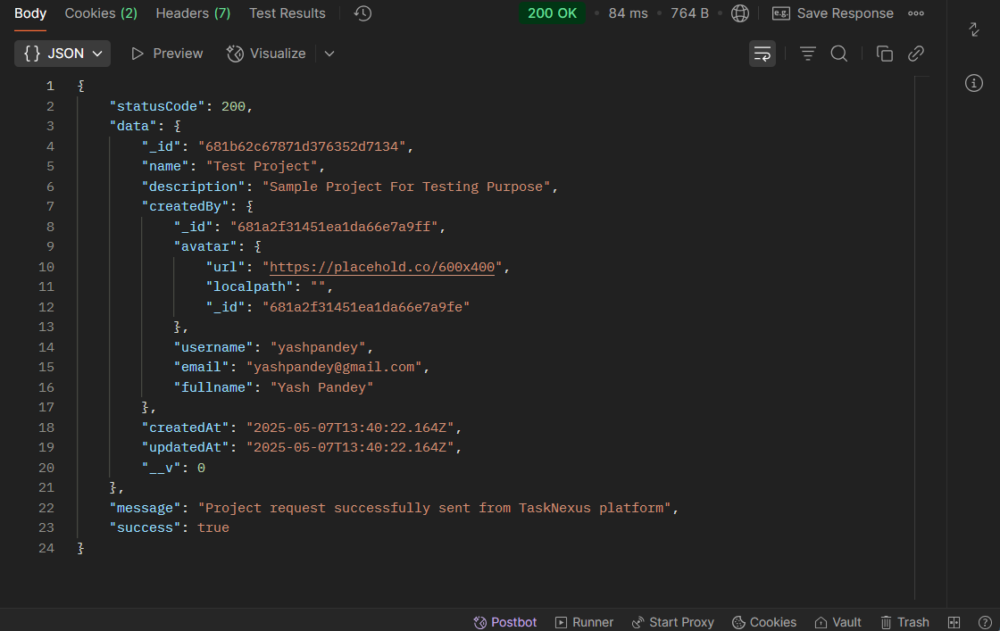

## 📝 Get Projects - Project Route `(TaskNexus Project)`

This route allows users to Project Details Based On ProjectID on the TaskNexus platform.

---

### 📍 Endpoint `/getproject`

- **Method:** `GET`
- **Endpoint:** `http://localhost:8080/api/v1/auth/project/getproject`
- **Example:** `http://localhost:8080/api/v1/project/getproject`
- **Description:** Returns All The Project Object.

### 📍 Endpoint `/getproject/:projectID`

- **Method:** `GET`
- **Endpoint:** `http://localhost:8080/api/v1/auth/project/getproject/:projectID`
- **Example:** `http://localhost:8080/api/v1/project/getproject/681b62c67871d376352d7134`
- **Description:** Returns the Project Object Based On ProjectID.

---

### ✅ Successful Response

On successful request, the server responds with a Success JSON object:

```json
{
  "statusCode": 200,
  "data": {
    "_id": "681b62c67871d376352d7134",
    "name": "Test Project",
    "description": "Sample Project For Testing Purpose",
    "createdBy": {
      "_id": "681a2f31451ea1da66e7a9ff",
      "avatar": {
        "url": "https://placehold.co/600x400",
        "localpath": "",
        "_id": "681a2f31451ea1da66e7a9fe"
      },
      "username": "yashpandey",
      "email": "pandeyyash041@gmail.com",
      "fullname": "Yash Pandey"
    },
    "createdAt": "2025-05-07T13:40:22.164Z",
    "updatedAt": "2025-05-07T13:40:22.164Z",
    "__v": 0
  },
  "message": "Project request successfully sent from TaskNexus platform",
  "success": true
}
```

---

### 📸 Screenshot of Response on Postman

---

#### ✅ Successful `/getproject/:projectID` Response



#### ✅ Successful `/getproject/:projectID` Response



---

### 📌 Purpose

The `getProjects` route handles Project Object Return setup, ensuring secure Sharing on the TaskNexus platform.
