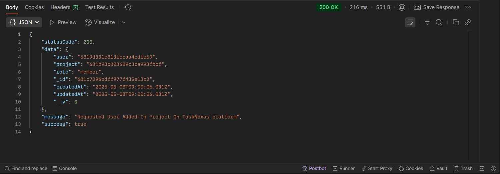
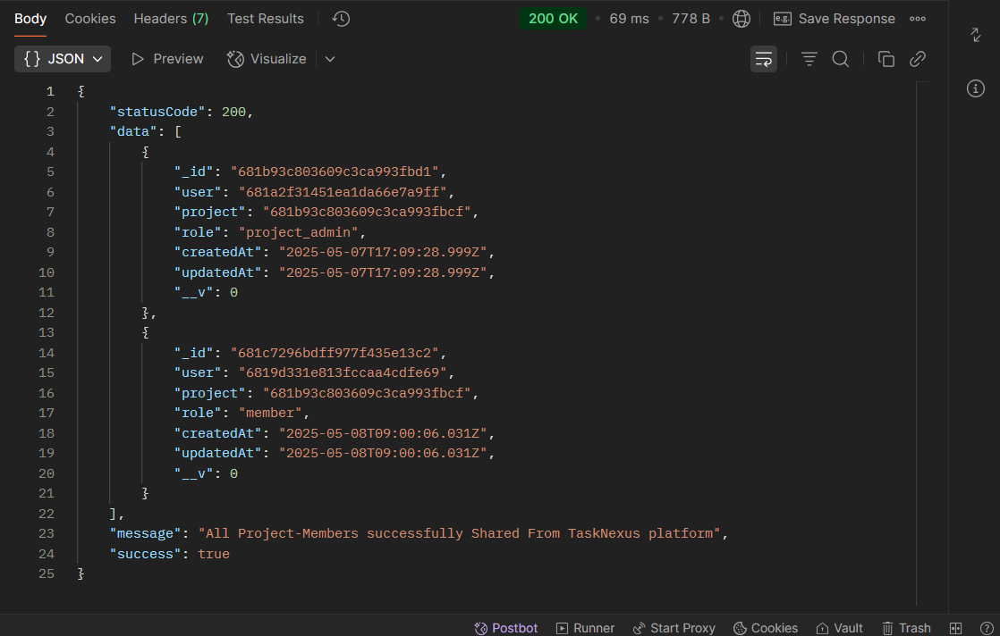
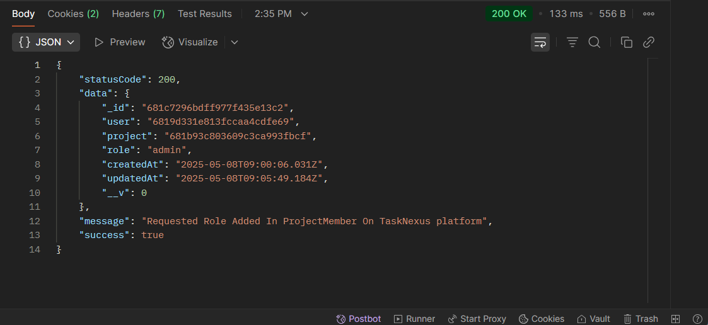

## 📝 CRUD ProjectMember - Task Route `(TaskNexus Project)`

This route allows users to Perform CRUD On ProjectMember on the TaskNexus platform.

---

### 🔐 1. User Authentication Required

Ensure the user is **logged in** before attempting to create a project.

**Endpoint:**
`POST http://localhost:8080/api/v1/auth/login`

### 📥 Request Body (JSON)

The following 4 fields are required:

```json
{
  "email": "pandeyyash041@gmail.com",
  "username": "YashPandey29",
  "password": "YashPandey1234"
}
```

#### ✅ Successful Login Response

## 

#### 🍪 Cookies in Postman

## 

### 🚀 2. CRUD Operations On ProjectMember

After a successful login, use the following endpoints to perform Create, Read, Update, and Delete operations on ProjectMember. Make sure to include your JWT token in the headers for authorization.

### 🔨 **1. Create New ProjectMember**

- **Method**: `POST`
- **Endpoint**: `http://localhost:8080/api/v1/project/project-member/:projectID`
- **Example**: `http://localhost:8080/api/v1/project/project-member/681b93c803609c3ca993abcd`

#### 📥 Request Body

```json
{
  "userID": "6819d331e813fccaa4cabcde"
}
```

#### ✅ Successful created ProjectMember Response

## 

---

### 📄 **2. Get All ProjectMember (Read)**

- **Method**: `GET`
- **Endpoint**: `http://localhost:8080/api/v1/project/project-member/:projectID`
- **Example**: `http://localhost:8080/api/v1/project/project-member/681b93c803609c3ca993abcd`

#### ✅ Successful Get All Assigned ProjectMember Response

## 

---

### ✏️ **3. Update ProjectMember Role**

- **Method**: `PUT`
- **Endpoint**: `http://localhost:8080/api/v1/project/project-member/change/:projectMemberID`
- **Example**: `http://localhost:8080/api/v1/project/project-member/change/681c64ce349b47c5ab73abcd`

#### 📥 Request Body

```json
{
  "role": "admin"
}
```

#### ✅ Successful Update ProjectMember Role Response

## 

---

### ❌ **4. Delete Task**

- **Method**: `DELETE`
- **Endpoint**: `http://localhost:8080/api/v1/project/project-member/change/:projectMemberID`
- **Example**: `http://localhost:8080/api/v1/project/project-member/change/681c64ce349b47c5ab73abcd`

#### ✅ Successful Delete ProjectMember Response

## 

---

### 📌 Purpose

The `/project/project-member` route handles CRUD Operations On ProjectMember Of An Project on the TaskNexus platform.
