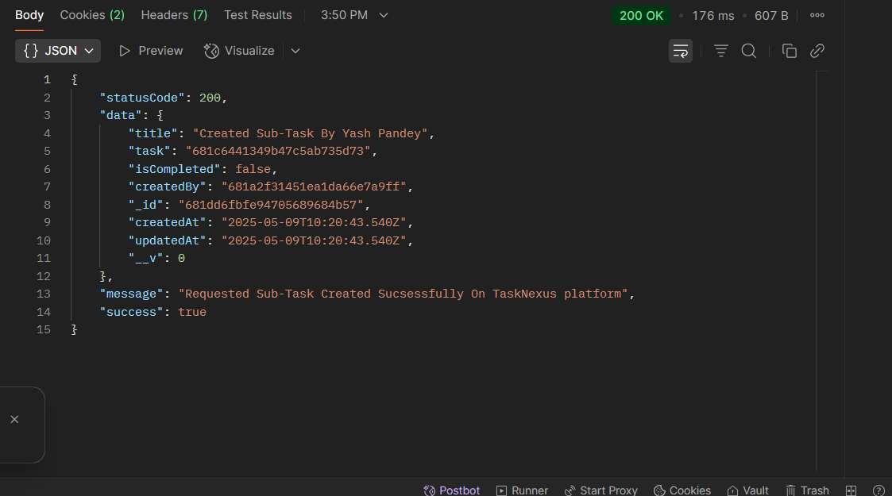
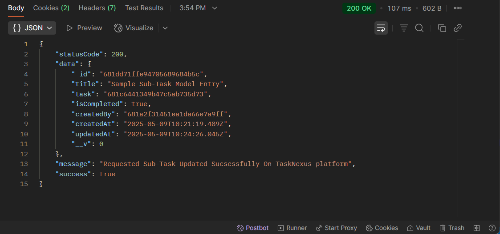
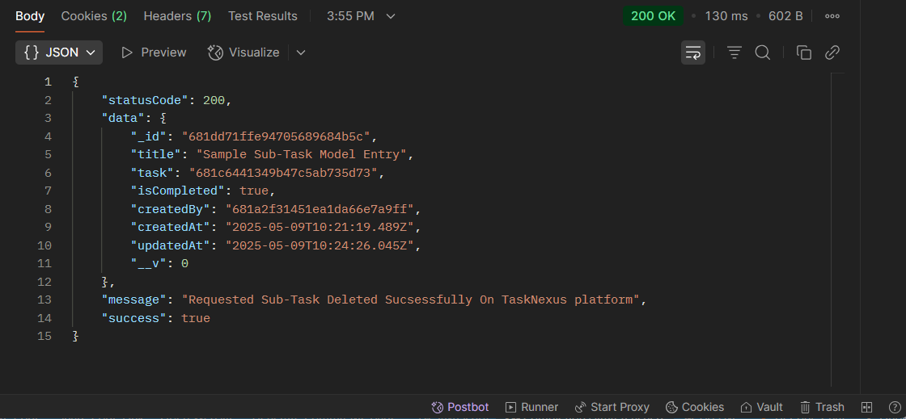

## 📝 CRUD Tasks - SubTask Route `(TaskNexus Project)`

This route allows users to Perform CRUD On SubTasks on the TaskNexus platform.

---

### 🔐 1. User Authentication Required

Ensure the user is **logged in** before attempting to create a project.

**Endpoint:**
`POST http://localhost:8080/api/v1/auth/login`

### 📥 Request Body (JSON)

The following 4 fields are required:

```json
{
  "email": "pandeyyash041@gmail.com",
  "username": "YashPandey29",
  "password": "YashPandey1234"
}
```

#### ✅ Successful Login Response

## 

#### 🍪 Cookies in Postman

## 

### 🚀 2. CRUD Operations On SubTask

After a successful login, use the following endpoints to perform Create, Update, and Delete operations on SubTasks. Make sure to include your JWT token in the headers for authorization.

### 🔨 **1. Create SubTask**

- **Method**: `POST`
- **Endpoint**: `http://localhost:8080/api/v1/task/subtask/create/:taskID`
- **Example**: `http://localhost:8080/api/v1/task/subtask/create/681c6441349b47c5ab735d73`

#### 📥 Request Body

```json
{
  "title": "Yash Pandey Has Created This Sub-Task"
  "isCompleted": false
}
```

#### ✅ Successful created SubTask Response

## 

---

### ✏️ **2. Update SubTask**

- **Method**: `PUT`
- **Endpoint**: `http://localhost:8080/api/v1/task/subtask/:subtaskID`
- **Example**: `http://localhost:8080/api/v1/task/subtask/681c6441349b47c5ab735d73`

#### 📥 Request Body

```json
{
  "title": "Yash Pandey Has Updated This Sub-Task"
  "isCompleted": true
}
```

#### ✅ Successful Update SubTask Response

## 

---

### ❌ **3. Delete Task**

- **Method**: `DELETE`
- **Endpoint**: `http://localhost:8080/api/v1/task/subtask/:subtaskID`
- **Example**: `http://localhost:8080/api/v1/task/subtask/681c6441349b47c5ab735d73`

#### ✅ Successful Delete SubTask Response

## 

---

### 📌 Purpose

The `/task/subtask` route handles CRUD Operations On SubTask on the TaskNexus platform.
