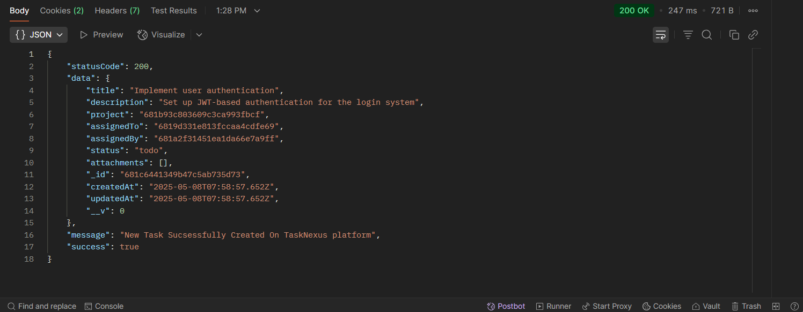
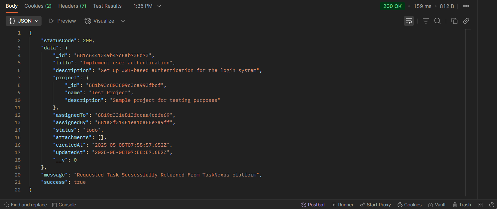
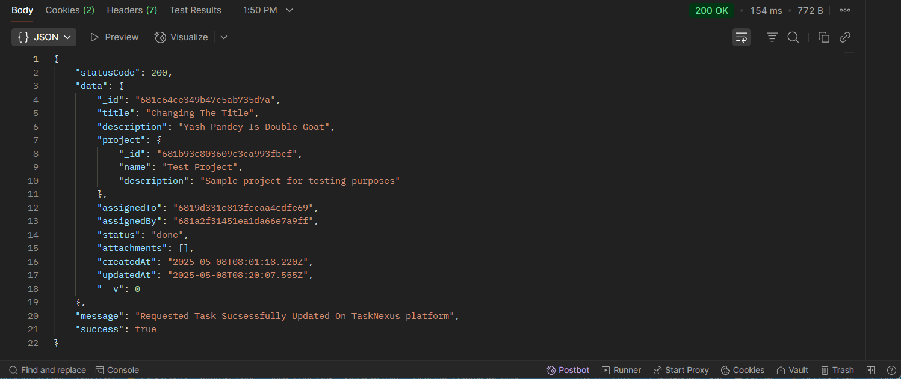
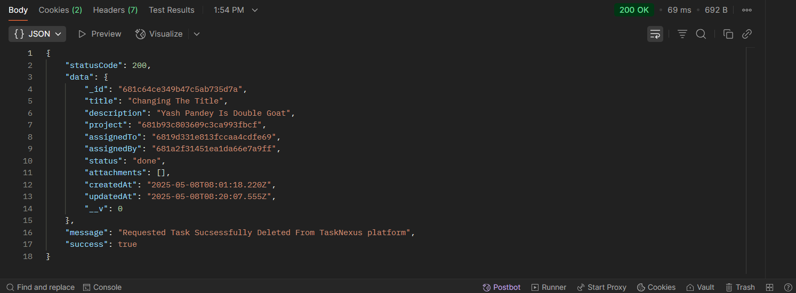

## 📝 CRUD Tasks - Task Route `(TaskNexus Project)`

This route allows users to Perform CRUD On Tasks on the TaskNexus platform.

---

### 🔐 1. User Authentication Required

Ensure the user is **logged in** before attempting to create a project.

**Endpoint:**
`POST http://localhost:8080/api/v1/auth/login`

### 📥 Request Body (JSON)

The following 4 fields are required:

```json
{
  "email": "pandeyyash041@gmail.com",
  "username": "YashPandey29",
  "password": "YashPandey1234"
}
```

#### ✅ Successful Login Response

## 

#### 🍪 Cookies in Postman

## 

### 🚀 2. CRUD Operations On Task

After a successful login, use the following endpoints to perform Create, Read, Update, and Delete operations on tasks. Make sure to include your JWT token in the headers for authorization.

### 🔨 **1. Create Task**

- **Method**: `POST`
- **Endpoint**: `http://localhost:8080/api/v1/task/create-task/:projectID`
- **Example**: `http://localhost:8080/api/v1/task/create-task/681b93c803609c3ca993abcd`

#### 📥 Request Body

```json
{
  "name": "Test Task",
  "description": "This is a sample task"
}
```

#### ✅ Successful created Task Response

## 

---

### 📄 **2. Get All Tasks (Read)**

- **Method**: `GET`
- **Endpoint**: `http://localhost:8080/api/v1/task/get-tasks`
- **Example**: `http://localhost:8080/api/v1/task/get-tasks`

#### ✅ Successful Get All Assigned Tasks Response

## 

---

### 🔍 **3. Get Single Task by ID**

- **Method**: `GET`
- **Endpoint**: `http://localhost:8080/api/v1/task/get-task/:taskID`
- **Example**: `http://localhost:8080/api/v1/task/get-task/872a4cfb98679a1dbaccabcd`

#### ✅ Successful Get TaskByID Response

## 

---

### ✏️ **4. Update Task**

- **Method**: `PUT`
- **Endpoint**: `http://localhost:8080/api/v1/task/:taskID`
- **Example**: `http://localhost:8080/api/v1/task/681c64ce349b47c5ab73abcd`

#### 📥 Request Body

```json
{
  "title": "Changing The Title",
  "description": "Yash Pandey Is GOAT",
  "status": "done"
}
```

#### ✅ Successful Update Task Response

## 

---

### ❌ **5. Delete Task**

- **Method**: `DELETE`
- **Endpoint**: `http://localhost:8080/api/v1/task/:taskID`
- **Example**: `http://localhost:8080/api/v1/task/872a4cfb98679a1dbaccab12`

#### ✅ Successful Delete Task Response

## 

---

### 📌 Purpose

The `/task` route handles CRUD Operations On Task on the TaskNexus platform.
