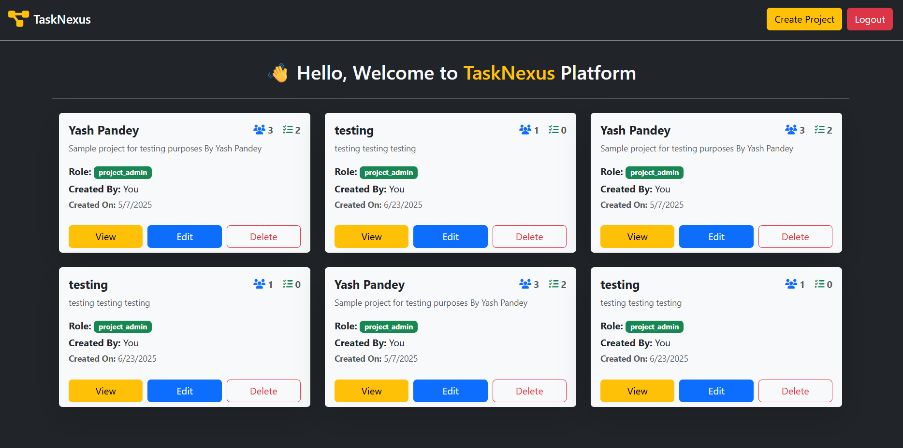
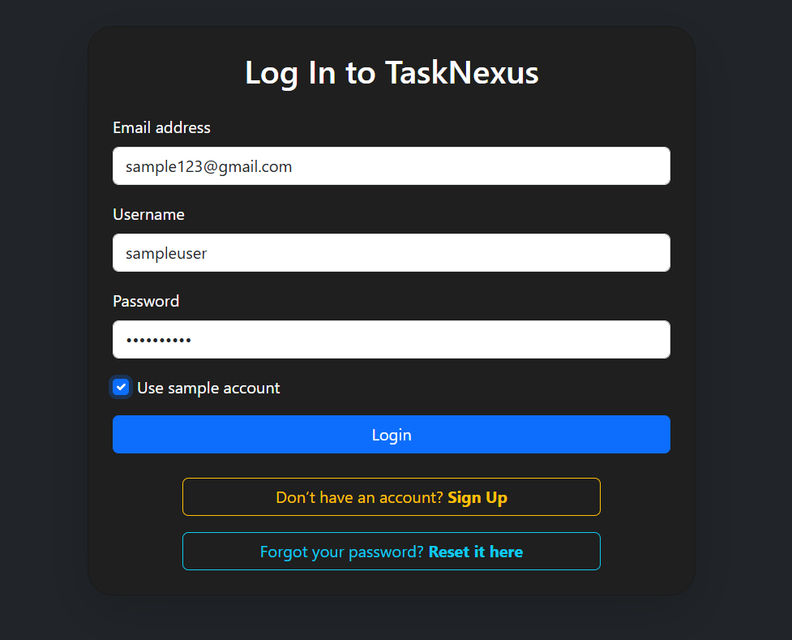
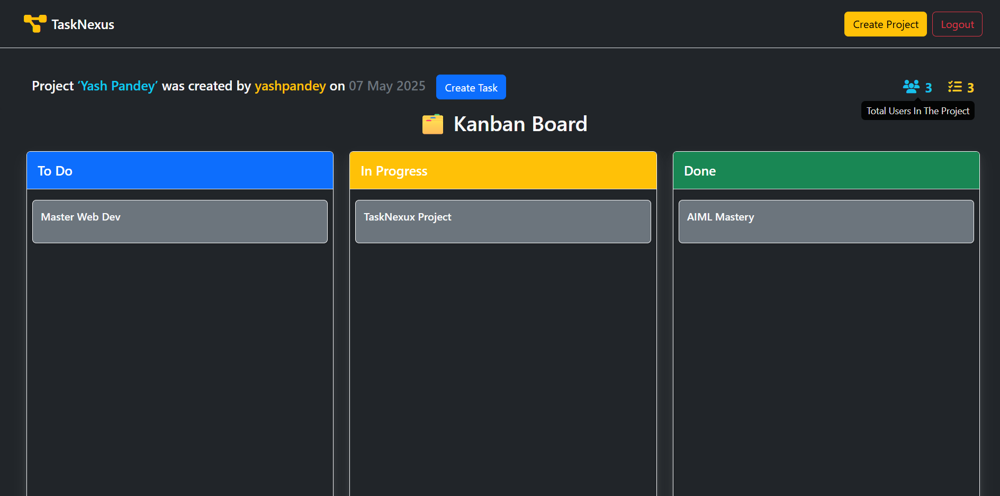

# Tasknexus 🧠📌


**Tasknexus** is a full-featured **Kanban Task Management System** designed for modern team collaboration. Built with the **MERN Stack**, it offers a scalable and extensible architecture backed by a real-time, drag-and-drop interface. Ideal for developers, teams, and product managers who value productivity and clean UI.

---

## 🚀 Project Status

- ✅ **Backend API development is completed**
- 🧪 **Frontend React integration is in progress**
- 🌍 **Frontend and Backend will be deployed separately on AWS (EC2 & S3)**
- 🔄 **Real-time features (WebSocket) and CI/CD pipeline integration are upcoming**

---

## 🔧 Tech Stack Breakdown

### 📌 Core Stack – MERN

- **MongoDB**: Document-based NoSQL database for fast and scalable storage.
- **Express.js**: RESTful backend framework to handle robust routing and middleware logic.
- **React.js**: Component-based frontend library, used for fast and dynamic UI rendering.
- **Node.js**: Event-driven runtime for writing scalable backend services.

### ⚙️ Frontend Ecosystem

- **TanStack Router**: A modern, type-safe, fileless routing solution offering nested layouts and full route control.
- **Zustand**: Minimalist and powerful state management library for global/shared state without boilerplate.
- **DnD Kit**: Lightweight, accessible drag-and-drop framework to implement Kanban card reordering.
- **Bootstrap 5**: Clean UI and responsive components using Bootstrap’s utility-first styling.
- **Axios**: For consistent and customizable API calls with interceptors for token handling.

### ☁️ Backend & Infrastructure

- **Node.js + Express.js** REST API (fully functional)
- **JWT Authentication** with role-based access control
- **Mongoose ODM** for MongoDB schema design
- **AWS EC2** (planned) for backend deployment
- **AWS S3 / CloudFront** (planned) for React frontend hosting

---

## ✨ Features

### ✅ Implemented

- 🧠 Create, Read, Update, Delete (CRUD) for tasks
- 📌 Drag-and-drop Kanban UI with smooth reordering
- 🔐 JWT-based user authentication (Login, Signup)
- 🧾 Project-wise task organization
- 📊 Role-based access (admin/user)
- 🧮 Subtask tracking and task metadata (priority, deadline, etc.)

### 🔄 In Progress

- 🧭 Advanced routing with TanStack Router
- 🔂 Global state management via Zustand
- 🛡️ Auth middleware for protected routes
- ☁️ AWS deployment configuration

### 🛠️ Coming Soon

- 🔄 Real-time sync using WebSocket/Socket.IO
- 📈 Activity logs and audit trail
- 🌐 Multi-user collaboration
- 🧪 Unit + Integration tests (Jest/Supertest)

---

## 🧪 Local Setup

### Backend

```bash
git clone https://github.com/your-username/tasknexus.git
cd tasknexus/backend

# Install dependencies
npm install

# Start backend server
npm run dev
```

### Frontend (React + Zustand + TanStack Router)

```bash
cd tasknexus/frontend

# Install dependencies
npm install

# Start React dev server
npm run dev
```

> Ensure MongoDB is running locally or set your Atlas URI in `.env`.

---

## 📸 UI Preview

> Below are some live previews of the current UI components built with React and Bootstrap:

### 🏠 Home Page



---

### 🔐 Login Form



---

### 🧾 Sign Up Form


---

### 📁 Project Section



---

## 🌐 Deployment Strategy

- **Frontend**: Will be hosted on AWS S3 + CloudFront or Vite static output
- **Backend**: Will run on AWS EC2 Ubuntu instance with reverse proxy (Nginx)
- **Environment Variables**: Managed using `.env` files and AWS Secrets Manager

---

## 🤝 Contributing

Contribution guidelines will be published post v1.0 release. For now, feel free to fork and experiment with the code.

---

## 👨‍💻 Author

Developed and maintained by **Yash Pandey**, a MERN developer passionate about building performant web apps with real-time UX and clean architecture.
