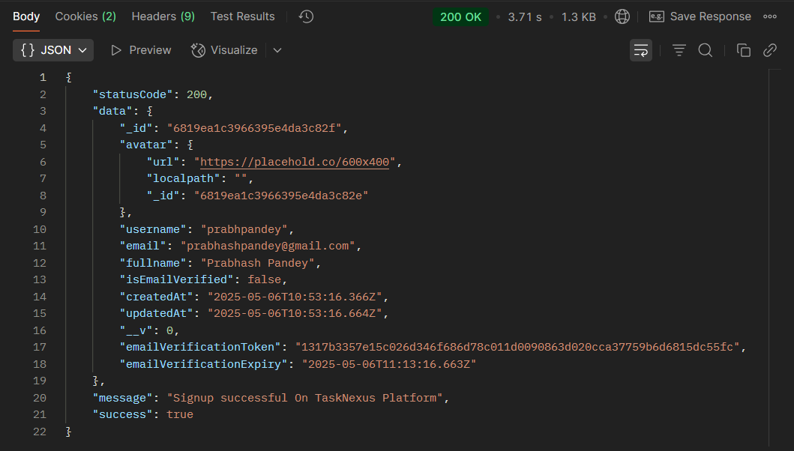
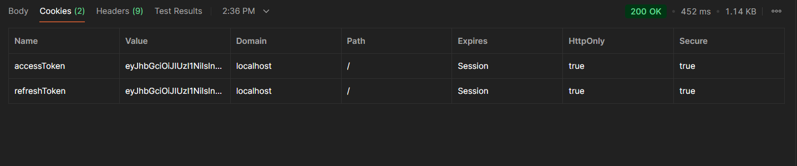
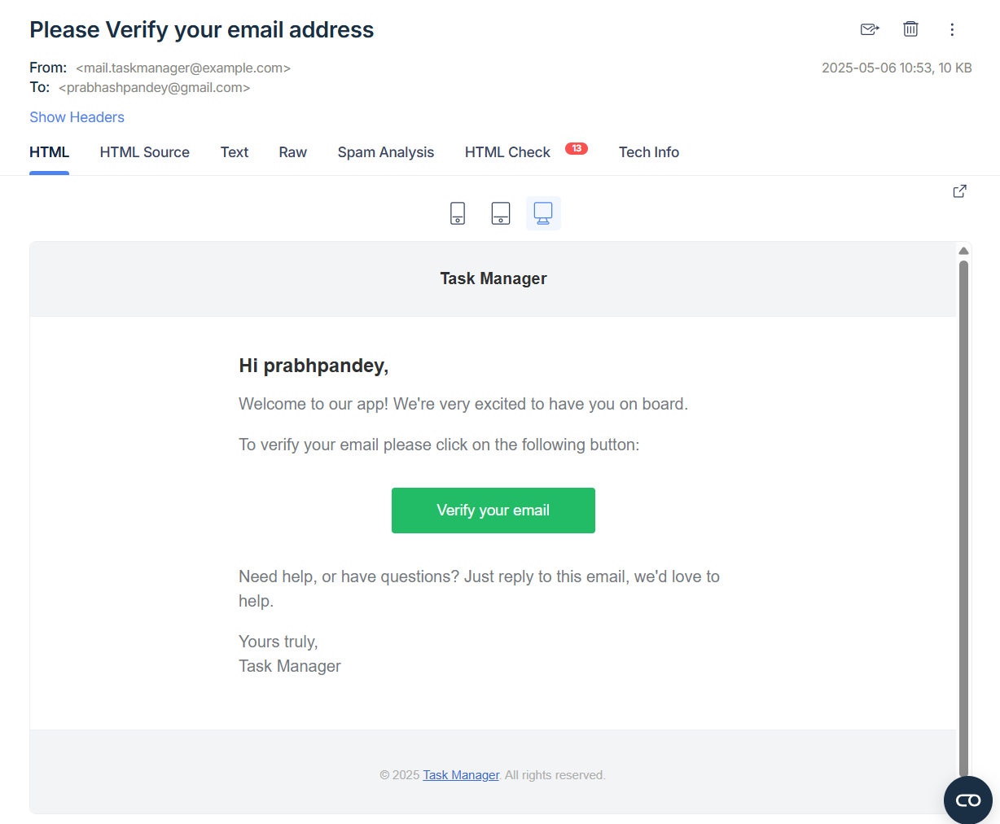

## 📝 Register User - Authorization Route `(TaskNexus Project)`

This route allows users to sign up on the TaskNexus platform by providing the required credentials.

---

### 📍 Endpoint

**POST** `http://localhost:8080/api/v1/auth/register`

---

### 📥 Request Body (JSON)

The following 4 fields are required:

```json
{
  "email": "pandeyyash041@gmail.com",
  "username": "YashPandey29",
  "fullname": "Yash Pandey",
  "password": "YashPandey1234"
}
```

---

### ✅ Successful Response

On successful signup, the server responds with a JSON object and sets **two HTTP-only cookies**:

- `accessToken` (JWT Access Token)
- `refreshToken` (JWT Refresh Token)

```json
{
  "statusCode": 200,
  "data": {
    "_id": "d130c513157c4b2e4aba",
    "avatar": {
      "url": "https://placehold.co/600x400",
      "localpath": "",
      "_id": "6819d130c513157c4b2e4ab9"
    },
    "username": "YashPandey29",
    "email": "pandeyyash041@gmail.com",
    "fullname": "Yash Pandey",
    "isEmailVerified": false,
    "createdAt": "2025-05-06T09:06:56.908Z",
    "updatedAt": "2025-05-06T09:06:57.115Z",
    "__v": 0
  },
  "message": "Signup successful On TaskNexus Platform",
  "success": true
}
```

---

### 🔐 Authentication

This route initializes **JWT-based authentication** by setting:

- `accessToken` for short-term authentication
- `refreshToken` for reissuing tokens securely

---

### 📸 Screenshot of Response on Postman

---

#### ✅ Successful Registration Response



#### 🍪 Cookies in Postman



#### 🍪 verification Mail Via Nodemailer + mailTrap



---

### 📌 Purpose

The `registerUser` route handles user registration and authentication setup, ensuring secure onboarding for users on the TaskNexus platform.
