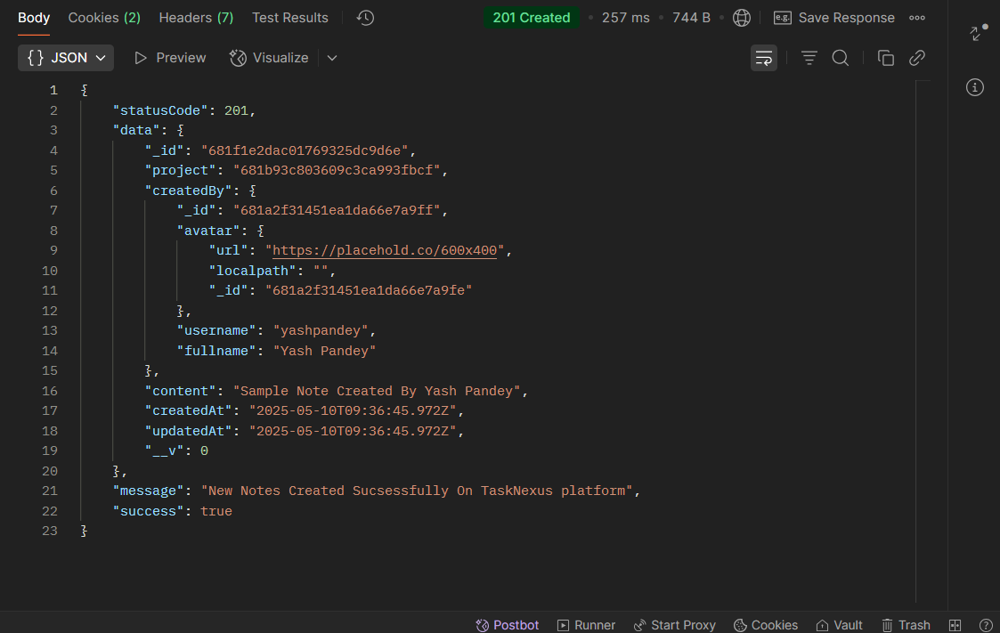
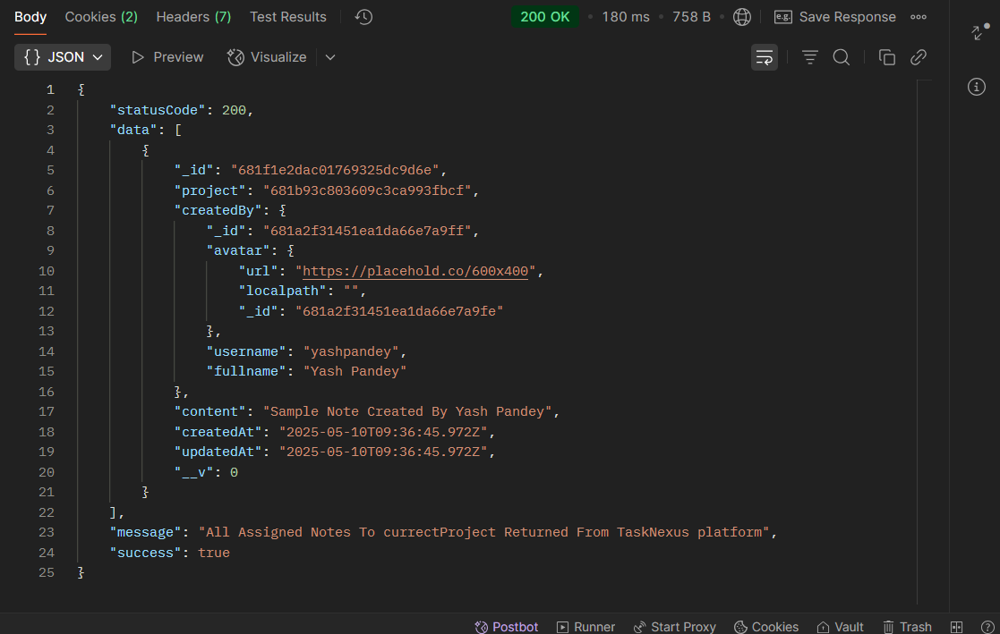
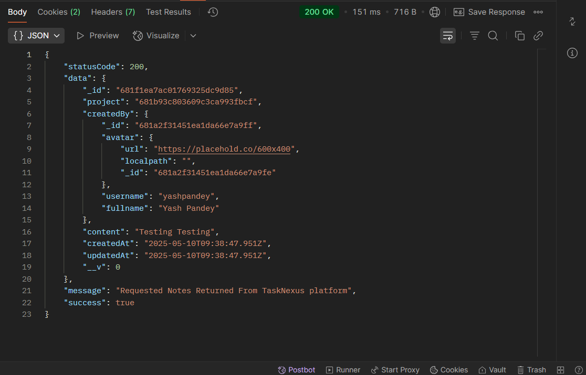
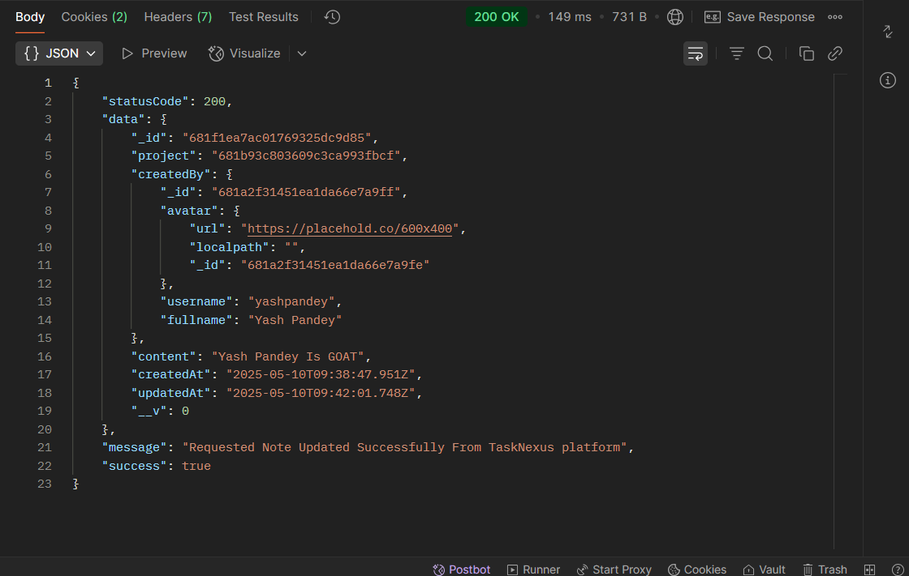
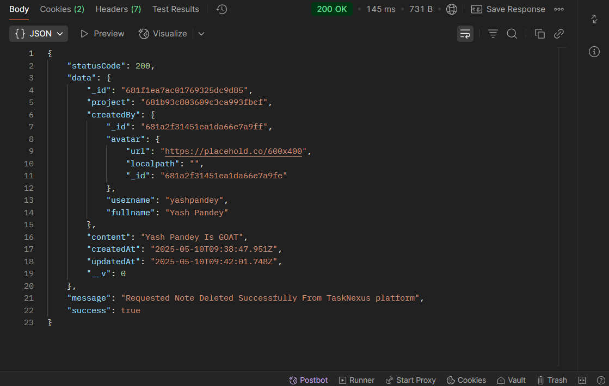

## 📝 CRUD Note - ProjectNote Route `(TaskNexus Project)`

This route allows users to Perform CRUD On ProjectNotes on the TaskNexus platform.

---

### 🔐 1. User Authentication Required

Ensure the user is **logged in** before attempting to create a project.

**Endpoint:**
`POST http://localhost:8080/api/v1/auth/login`

### 📥 Request Body (JSON)

The following 4 fields are required:

```json
{
  "email": "pandeyyash041@gmail.com",
  "username": "YashPandey29",
  "password": "YashPandey1234"
}
```

#### ✅ Successful Login Response

## 

#### 🍪 Cookies in Postman

## 

### 🚀 2. CRUD Operations On ProjectNote

After a successful login, use the following endpoints to perform Create, Read, Update, and Delete operations on ProjectNote. Make sure to include your JWT token in the headers for authorization.

### 🔨 **1. Create ProjectNote**

- **Method**: `POST`
- **Endpoint**: `http://localhost:8080/api/v1/note/:projectID`
- **Example**: `http://localhost:8080/api/v1/note/681b93c803609c3ca993abcd`

#### 📥 Request Body

```json
{
  "content": "Testing Note Created By Yash Pandey"
}
```

#### ✅ Successful created ProjectNote Response

## 

---

### 📄 **2. Get All ProjectNote (Read)**

- **Method**: `GET`
- **Endpoint**: `http://localhost:8080/api/v1/note/:projectID`
- **Example**: `http://localhost:8080/api/v1/note/681b93c803609c3ca993abcd`

#### ✅ Successful Get All Assigned ProjectNote Response

## 

---

### 🔍 **3. Get Single ProjectNote by ID**

- **Method**: `GET`
- **Endpoint**: `http://localhost:8080/api/v1/note/:projectID/n/:noteID`
- **Example**: `http://localhost:8080/api/v1/note/681b93c803609c3ca993abcd/n/681f1ea7ac01769325dcabcd`

#### ✅ Successful Get ProjectNoteByID Response

## 

---

### ✏️ **4. Update ProjectNote**

- **Method**: `PUT`
- **Endpoint**: `http://localhost:8080/api/v1/note/:projectID/n/:noteID`
- **Example**: `http://localhost:8080/api/v1/note/681b93c803609c3ca993abcd/n/681f1ea7ac01769325dcabcd`

#### 📥 Request Body

```json
{
  "content": "Testing Testing"
}
```

#### ✅ Successful Update ProjectNote Response

## 

---

### ❌ **5. Delete ProjectNote**

- **Method**: `DELETE`
  - **Endpoint**: `http://localhost:8080/api/v1/note/:projectID/n/:noteID`
  - **Example**: `http://localhost:8080/api/v1/note/681b93c803609c3ca993abcd/n/681f1ea7ac01769325dcabcd`

#### ✅ Successful Delete ProjectNote Response

## 

---

### 📌 Purpose

The `/note` route handles CRUD Operations On ProjectNote on the TaskNexus platform.
