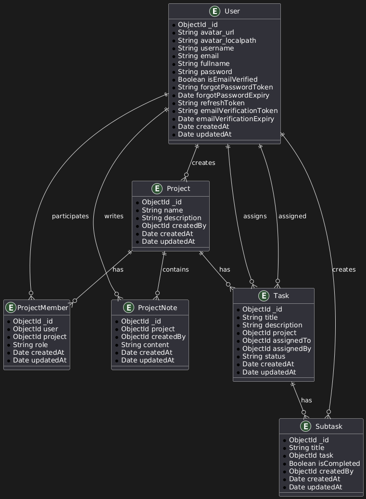

# Schema Summary

## 1. User-Schema Fields

- **avatar**: Object containing `url` (String) and `localpath` (String) with a default placeholder image.
- **username**: Unique, required, lowercase, and trimmed String.
- **email**: Unique, required, lowercase, and trimmed String.
- **fullname**: Required String storing the full name of the user.
- **password**: Required String with a custom error message on absence.
- **isEmailVerified**: Boolean flag indicating whether the email is verified (default: false).
- **forgotPasswordToken**: String storing a token for password reset.
- **forgotPasswordExpiry**: Date storing the expiration time of the password reset token.
- **refreshToken**: String storing the authentication refresh token.
- **emailVerificationToken**: String storing a token for email verification.
- **emailVerificationExpiry**: Date storing the expiration time for email verification.
- **timestamps**: Automatically adds `createdAt` and `updatedAt` fields.

## 2. Project-Schema Fields

- **name**: Unique, required, and trimmed String representing the project name.
- **description**: Optional String providing additional project details.
- **createdBy**: Required ObjectId referencing the `User` model (project creator).
- **timestamps**: Automatically adds `createdAt` and `updatedAt` fields.

## 3. ProjectMember-Schema Fields

- **user**: Required ObjectId referencing the `User` model (assigned user).
- **project**: Required ObjectId referencing the `Project` model (associated project).
- **role**: String restricted to predefined roles (`enum`), defaults to `MEMBER`.
- **timestamps**: Automatically adds `createdAt` and `updatedAt` fields.

## 4. ProjectNote-Schema Fields

- **project**: Required ObjectId referencing the `Project` model (associated project).
- **createdBy**: Required ObjectId referencing the `User` model (note creator).
- **content**: Required String storing the note's text.
- **timestamps**: Automatically adds `createdAt` and `updatedAt` fields.

## 5. Task-Schema Fields

- **title**: Required, trimmed String representing the task title.
- **description**: Optional String providing additional task details.
- **project**: Required ObjectId referencing the `Project` model (associated project).
- **assignedTo**: Required ObjectId referencing the `User` model (task assignee).
- **assignedBy**: Required ObjectId referencing the `User` model (task assigner).
- **status**: String restricted to predefined statuses (`enum`), defaults to `TODO`.
- **attachments**: Array of objects containing `url`, `mimetype`, and `size`, defaults to an empty array.
- **timestamps**: Automatically adds `createdAt` and `updatedAt` fields.

## 6. Subtask-Schema Fields

- **title**: Required, trimmed String representing the subtask title.
- **task**: Required ObjectId referencing the `Task` model (associated task).
- **isCompleted**: Boolean indicating completion status, defaults to `false`.
- **createdBy**: Required ObjectId referencing the `User` model (subtask creator).
- **timestamps**: Automatically adds `createdAt` and `updatedAt` fields.

---

# 📌 ER Diagram of Schema

Here is the **Entity-Relationship (ER) Diagram** representing the database schema:

---

### 🔹 About This Diagram

✔ **Visualizes relationships** between different models.  
✔ **Shows how entities interact** within the system.  
✔ Helps in **database design & understanding**.

---
